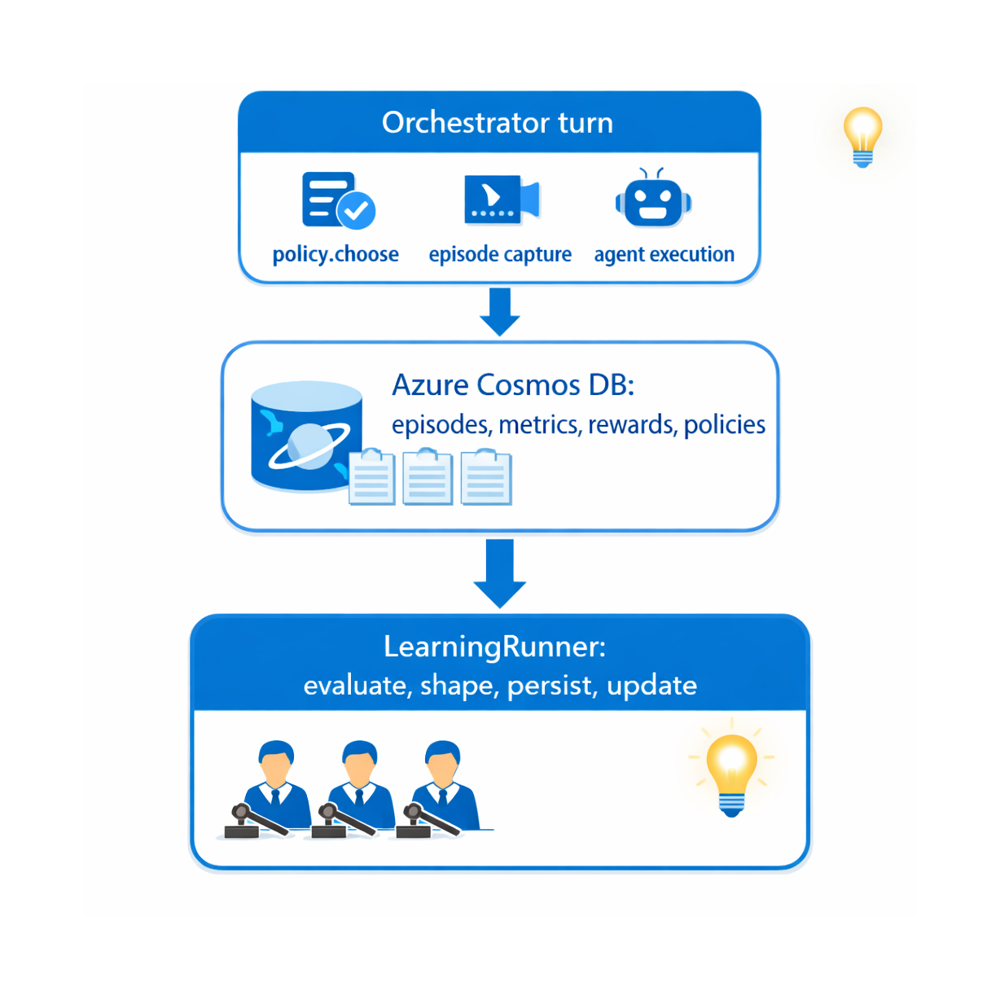

<p align="center">
  
</p>

# azure-agents-learning-sdk

Native reinforcement learning SDK for AI agents. An in-process
learner optimizes a small, interpretable policy over discrete agent
configuration choices (prompt variants, retrieval-k, tool selection
strategies, …) using Azure AI Evaluation judge metrics as the reward
signal.

## How it works

The SDK improves agents without LLM weight fine-tuning. There are no
GPU fine-tune jobs and no opaque update cycles — just three pieces
that run in your existing Python process:

1. The **policy** is a softmax distribution over `N` discrete
   actions (e.g., "use prompt template A", "use template B"). It
   lives in Python and updates in milliseconds.

   

2. Each episode is **judged** by three Azure AI Evaluation
   evaluators — `IntentResolutionEvaluator`, `TaskAdherenceEvaluator`,
   and `TaskCompletionEvaluator` — whose scores are combined into a
   single scalar reward.

   

3. A **REINFORCE-with-baseline** learner updates the policy logits
   directly from logged episodes. Updates are tiny gradient steps
   that run on CPU and persist immediately to Cosmos DB.

   

Every episode, reward, run, and deployment is captured in Cosmos DB,
giving you a complete lineage and audit trail of how the policy
evolved over time.

## Architecture

<p align="center">
  
</p>

<details>
<summary>Text diagram (same flow, plain ASCII)</summary>

```
┌──────────────────────────────────────────────────────────┐
│  Orchestrator turn                                       │
│  ┌─────────────────────────────────────────────────────┐ │
│  │ policy.choose() → Action                            │ │
│  │ EpisodeCapture.start(action_id=…, logprob=…)        │ │
│  │ … run agent, record tool calls …                    │ │
│  │ EpisodeCapture.end(assistant_output=…)              │ │
│  └─────────────────────────────────────────────────────┘ │
│                       │                                  │
│                       ▼                                  │
│  ┌─────────────────────────────────────────────────────┐ │
│  │ Cosmos DB: episodes, metrics, rewards, policies     │ │
│  └─────────────────────────────────────────────────────┘ │
│                       │                                  │
│                       ▼                                  │
│  ┌─────────────────────────────────────────────────────┐ │
│  │ LearningRunner.run_offline_batch(agent_id)          │ │
│  │   ┌─ evaluate (3 judges)                            │ │
│  │   ├─ shape (weighted sum + penalties → reward)      │ │
│  │   ├─ persist per-metric + aggregate rewards         │ │
│  │   └─ ReinforceLearner.update(policy, episodes)      │ │
│  └─────────────────────────────────────────────────────┘ │
└──────────────────────────────────────────────────────────┘
```

</details>

## Install

Released versions are published to PyPI:
<https://pypi.org/project/azure-agents-learning-sdk/>.

```bash
pip install azure-agents-learning-sdk
```

For local development against a checkout of this repository:

```bash
pip install -e .
```

## Configure

The SDK reads its configuration from environment variables. The most
important ones are:

| Variable | Purpose | Default |
| --- | --- | --- |
| `AGENT_LEARNING_COSMOS_ENDPOINT` | Cosmos DB account URL (enables persistence) | unset |
| `AGENT_LEARNING_COSMOS_DATABASE` | Database name | `dq_rl` |
| `AGENT_LEARNING_JUDGE_ENDPOINT` | Azure OpenAI endpoint used by the judge | unset |
| `AGENT_LEARNING_JUDGE_DEPLOYMENT` | Judge deployment name | unset |
| `AGENT_LEARNING_W_INTENT` | Weight for intent-resolution reward | `0.4` |
| `AGENT_LEARNING_W_ADHERENCE` | Weight for task-adherence reward | `0.3` |
| `AGENT_LEARNING_W_COMPLETION` | Weight for task-completion reward | `0.3` |
| `AGENT_LEARNING_LR` | REINFORCE learning rate | `0.05` |
| `AGENT_LEARNING_BASELINE_DECAY` | EMA decay on the value baseline | `0.9` |

When the Cosmos endpoint or judge configuration is missing, the SDK
falls back to an in-memory store and skips evaluations so unit
tests still pass.

## Use it

```python
from agent_learning import (
    Action, EpisodeCapture, LearningRunner, SoftmaxPolicy,
)

actions = [
    Action(id="concise"),
    Action(id="detailed"),
]
policy = SoftmaxPolicy.from_actions(actions, agent_id="dq")

# At inference time
decision = policy.choose()
capture = EpisodeCapture()
ctx = capture.start(
    user_input="Summarise Q3 sales",
    policy_id=policy.snapshot().id,
    policy_version=policy.snapshot().version,
    action_id=decision.action.id,
    action_logprob=decision.logprob,
)
# … run your agent, then call:
capture.end(ctx, assistant_output="…")

# Periodically (cron, manual, event-driven)
runner = LearningRunner(policy=policy)
run = runner.run_offline_batch("dq", episode_limit=500)
```

The included CLI exposes the same flow:

```bash
agent-learn init-policy --agent-id dq --actions ./actions.json
agent-learn train --agent-id dq --limit 500
agent-learn policy --agent-id dq
```

## Layout

```
src/agent_learning/
├── types.py            # Durable record types
├── config.py           # Env-driven configuration
├── capture.py          # Episode capture hook
├── storage/            # LearningStore (Cosmos + in-memory)
├── metrics/            # IntentResolution/TaskAdherence/TaskCompletion
├── rewards/            # Shaping + writer
├── policy/             # SoftmaxPolicy
├── learners/           # REINFORCE
├── training/           # End-to-end runner
└── cli.py              # `agent-learn` command-line
```

## Testing

```bash
pytest -q
```

The test suite covers types, the in-memory store, the policy,
reward shaping, the REINFORCE learner, and an end-to-end training
loop with a stubbed metric evaluator.
