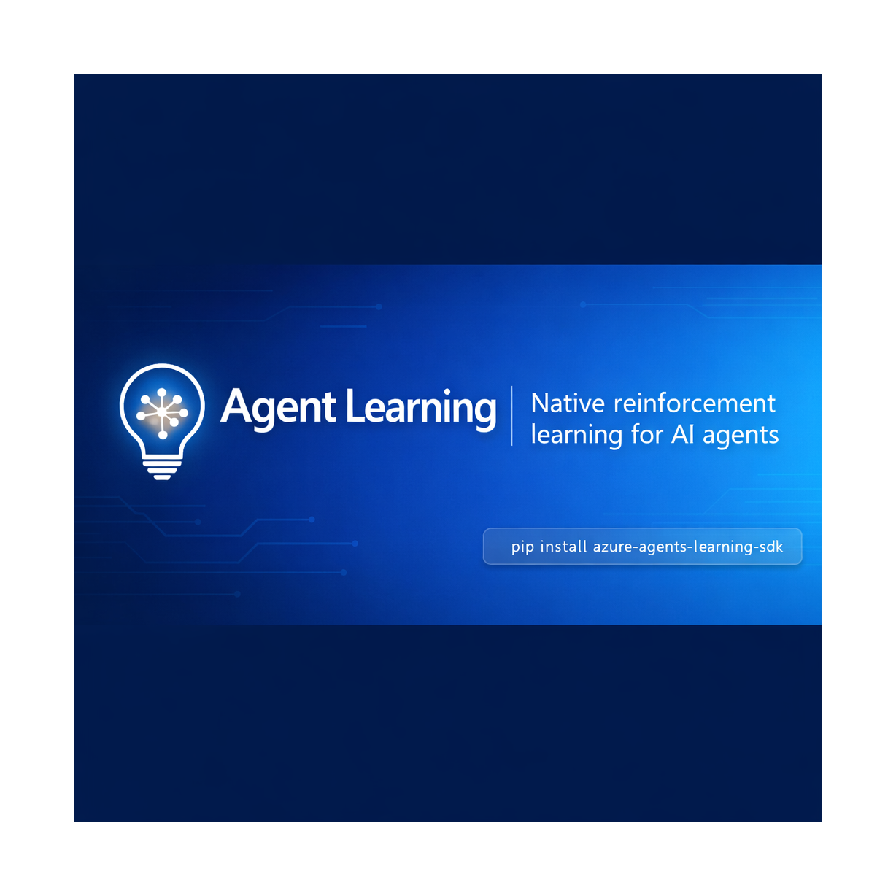
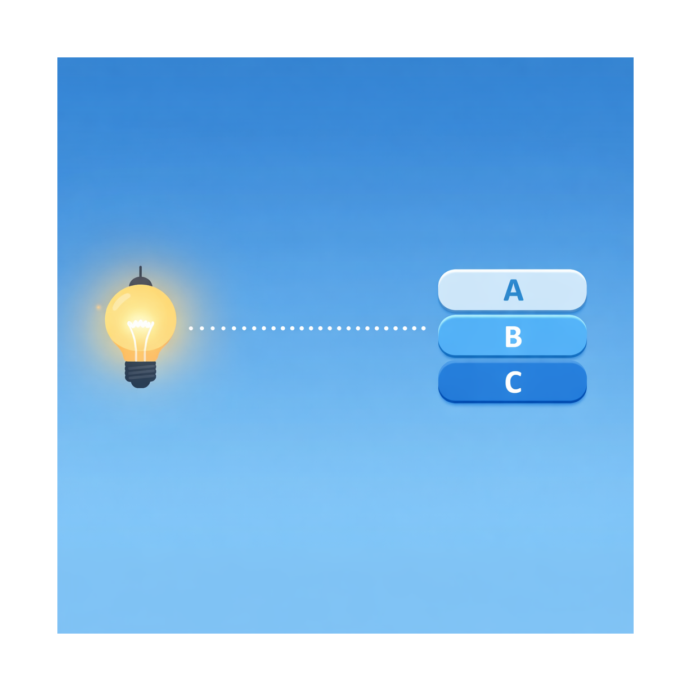
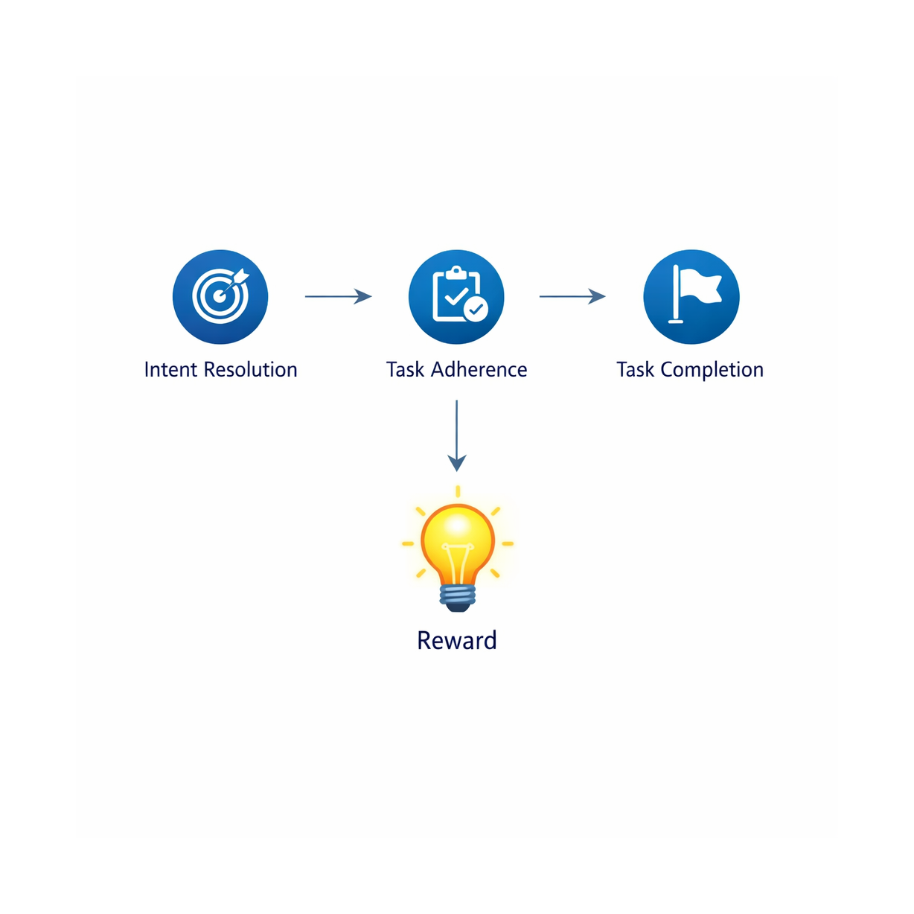

<p align="center">
  
</p>

# agents-learning-sdk

Native reinforcement learning SDK for AI agents. An in-process
learner optimizes a small, interpretable policy over discrete agent
configuration choices (prompt variants, retrieval-k, tool selection
strategies, …) using Azure AI Evaluation judge metrics as the reward
signal.

<p align="center">
  
</p>

## How it works

The SDK improves agents without LLM weight fine-tuning. There are no
GPU fine-tune jobs and no opaque update cycles — just three pieces
that run in your existing Python process:

1. The **policy** is a softmax distribution over `N` discrete
   actions (e.g., "use prompt template A", "use template B"). It
   lives in Python and updates in milliseconds.

   

2. Each episode is **judged** by three Azure AI Evaluation
   evaluators — `IntentResolutionEvaluator`, `TaskAdherenceEvaluator`,
   and `TaskCompletionEvaluator` — whose scores are combined into a
   single scalar reward.

   

3. A **REINFORCE-with-baseline** learner updates the policy logits
   directly from logged episodes. Updates are tiny gradient steps
   that run on CPU and persist through a pluggable store — in-memory
   or local files by default, with Cosmos DB optional.

   

Every episode, reward, run, and deployment is captured by the
configured store — in-memory or local files by default, or Cosmos DB —
giving you a complete learning history of how the policy
evolved over time.

## Install

Released versions are published to PyPI:
<https://pypi.org/project/agents-learning-sdk/>.

```bash
pip install agents-learning-sdk
```

For local development against a checkout of this repository:

```bash
pip install -e .
```

### Windows CLI installer (Scout-friendly)

If Scout runs outside a Python-managed environment, download `agent-learn.exe`
or the standalone installer from the
[latest GitHub release](https://github.com/microsoft/agents-learning-sdk/releases/latest).
Each release is attached to a `v<version>` tag. The installer places
`agent-learn.exe` on disk and can add its install directory to your user
`PATH`, so `agent-learn` works from Command Prompt and PowerShell without
`pip install`.

Pushes to `main` release the version declared in `pyproject.toml` and
`src/agent_learning/_version.py`, attach the Windows executables, and then
publish the matching Python package to PyPI. Increment both version declarations
before the next production release.

## Configure

The SDK reads its configuration from environment variables. Every
variable is optional — with no configuration the SDK runs against an
in-memory store. The most important ones are:

| Variable | Purpose | Default |
| --- | --- | --- |
| `AGENT_LEARNING_STORE_BACKEND` | Storage backend: `memory`, `cosmos`, or `local` | `memory` |
| `AGENT_LEARNING_COSMOS_ENDPOINT` | Cosmos DB account URL (only used when backend is `cosmos`) | unset |
| `AGENT_LEARNING_COSMOS_DATABASE` | Cosmos DB database name (only used when backend is `cosmos`) | `dq_rl` |
| `AGENT_LEARNING_LOCAL_STORE_DIR` | Directory for the `local` file backend | `./data/agent-learning/store` |
| `AGENT_LEARNING_JUDGE_ENDPOINT` | Azure OpenAI endpoint used by the judge | unset |
| `AGENT_LEARNING_JUDGE_DEPLOYMENT` | Judge deployment name | unset |
| `AGENT_LEARNING_W_INTENT` | Weight for intent-resolution reward | `0.4` |
| `AGENT_LEARNING_W_ADHERENCE` | Weight for task-adherence reward | `0.3` |
| `AGENT_LEARNING_W_COMPLETION` | Weight for task-completion reward | `0.3` |
| `AGENT_LEARNING_LR` | REINFORCE learning rate | `0.05` |
| `AGENT_LEARNING_BASELINE_DECAY` | EMA decay on the value baseline | `0.9` |

By default the SDK uses a volatile in-memory store. Set
`AGENT_LEARNING_STORE_BACKEND=cosmos` (together with the Cosmos
variables above) for durable Cosmos DB persistence, or `=local` to
persist to JSON files on disk. When the judge configuration is
missing, the SDK skips evaluations so unit tests still pass.

The `agent-learn` CLI defaults to the local file store because each command
runs in a separate process. Use `--store-dir` on its commands to select a
different local directory, or set `AGENT_LEARNING_STORE_BACKEND` explicitly
to use another configured backend.

## Use it

```python
from agent_learning import (
    Action, EpisodeCapture, LearningRunner, SoftmaxPolicy,
)

actions = [
    Action(id="concise"),
    Action(id="detailed"),
]
policy = SoftmaxPolicy.from_actions(actions, agent_id="nba")

# At inference time
decision = policy.choose()
capture = EpisodeCapture()
ctx = capture.start(
    user_input="Summarise Q3 sales",
    policy_id=policy.snapshot().id,
    policy_version=policy.snapshot().version,
    action_id=decision.action.id,
    action_logprob=decision.logprob,
)
# … run your agent, then call:
capture.end(ctx, assistant_output="…")

# Periodically (cron, manual, event-driven)
runner = LearningRunner(policy=policy)
run = runner.run_offline_batch("nba", episode_limit=500)
```

### Integrate with Scout

`ScoutLearningAdapter` wraps synchronous or asynchronous Scout actions and
appends one JSONL record per execution. Each record includes the requested
intent, selected action path, result or error, duration, and offline judge
signals for intent, adherence, and completion.

1. Install the SDK in the environment that runs Scout:

   ```bash
   pip install agents-learning-sdk
   ```

2. Create one adapter for the process. The output defaults to
   `scout-learning.jsonl`, or you can provide another local path:

   ```python
   from agent_learning import ScoutLearningAdapter

   learning = ScoutLearningAdapter("data/scout-learning.jsonl")
   ```

3. Wrap each Scout automation, skill, or MCP call with `execute`. Pass:

   - `intent`: the user's requested outcome.
   - `action_path`: stable path segments identifying the Scout action.
   - `action`: the callable Scout would normally invoke.
   - `args` or `action_kwargs`: inputs for that callable, when needed.
   - `contract` and `expected_tokens`: optional criteria for adherence and
     completion signals.

```python
result = learning.execute(
    intent="Create the weekly summary",
    action_path=["automation", "weekly-summary"],
    action=create_summary,
    action_kwargs={"week": "2026-W32"},
    contract={"required_substrings": ["summary"]},
    expected_tokens=["summary"],
)
```

For an asynchronous Scout action, use `execute_async` and pass its async
callable directly:

```python
issues = await learning.execute_async(
    intent="List open issues",
    action_path=["mcp", "github", "list_issues"],
    action=list_issues,
    action_kwargs={"owner": "microsoft", "repo": "agents-learning-sdk"},
    expected_tokens=["issues"],
)
```

The adapter returns the original callable's result unchanged. If the callable
raises, it records the failure and re-raises the same exception so existing
Scout error handling continues to work. Sensitive values in intents, results,
and errors are redacted before records are written.

The integration uses the SDK's pure-Python judges and local file I/O, so it
requires no Azure configuration. Use stable `action_path` values to group
records by automation, skill, or MCP tool when analyzing the learning data.
Review the output with any JSONL-aware tool, or run:

```bash
python -m json.tool --json-lines data/scout-learning.jsonl
```

See [examples/scout_learning.py](examples/scout_learning.py) for a complete
runnable integration covering automation, skill, and asynchronous MCP calls.

Scout can also use the CLI as a task lifecycle. `task-intent` chooses a policy
action and starts an episode; its JSON response includes the selected action
and `episode_id`. After Scout applies that action, `task-complete` updates the
same local episode with the final output.

```bash
agent-learn policy-init --agent-id scout --actions ./actions.json

agent-learn task-intent \
  --agent-id scout \
  --intent "Create the weekly summary" \
  --context '{"week":"2026-W32"}'

agent-learn task-complete \
  --agent-id scout \
  --episode-id "<episode_id from task-intent>" \
  --output "Weekly summary created"
```

The episode records the user intent, context, policy version, selected action,
selection probability, and completion output under
`./data/agent-learning/store` by default. Run `agent-learn train --agent-id
scout` periodically to judge completed episodes and update the policy, then
inspect it with `agent-learn policy --agent-id scout`.

## Examples

Three runnable examples in [examples/](examples/) build on each other.
All run in-process against the in-memory store with **no Azure
credentials** required.

| Example | Reward source | Objects it showcases |
| --- | --- | --- |
| [quickstart.py](examples/quickstart.py) | Stubbed constant | `SoftmaxPolicy`, built-in `ReinforceLearner`, `RewardShaper`, `LearningRunner` |
| [next_best_action.py](examples/next_best_action.py) | Simulated outcome | `ContextualSoftmaxPolicy` (contextual bandit), a contextual policy-gradient learner |
| [judged_optimization.py](examples/judged_optimization.py) | **Real Tier 1 judges** | `build_judges` (tiered judges), `JudgeScore`→`MetricResult`, routing + hallucination **shaping** penalties, rich `Episode` records |
| [scout_learning.py](examples/scout_learning.py) | Tier 1 judge signals | `ScoutLearningAdapter` for automation, skill, and MCP execution |

Start with [judged_optimization.py](examples/judged_optimization.py) to
see the SDK's judge layer, reward shaping, metrics, policy, learner, and
episode capture working together end to end:

```bash
python examples/judged_optimization.py
```

## Layout

```
src/agent_learning/
├── types.py            # Durable record types
├── config.py           # Env-driven configuration
├── capture.py          # Episode capture hook
├── storage/            # LearningStore (Cosmos + local file + in-memory)
├── metrics/            # IntentResolution/TaskAdherence/TaskCompletion
├── rewards/            # Shaping + writer
├── policy/             # SoftmaxPolicy
├── learners/           # REINFORCE
├── training/           # End-to-end runner
└── cli.py              # `agent-learn` command-line
```

## Unit Testing

```bash
pytest -q
```

The test suite covers types, the in-memory store, the policy,
reward shaping, the REINFORCE learner, and an end-to-end training
loop with a stubbed metric evaluator.

## Use

```bash
python -m venv .venv
.venv\Scripts\Activate.ps1
pip install -r requirements.txt

```
