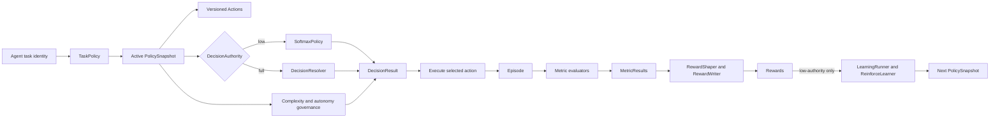

# Agent learning ERD analysis

## Executive assessment

The current [ERD](agent-learning-erd.mermaid) is a useful **concept map**, but
it is not a reliable entity relationship or persistence model. Its primary
weakness is category mixing: durable records, nested values, inferred
identities, runtime services, request-scoped objects, algorithm outputs, and
enums all use the same entity notation.

The high-level product story is aligned with the documentation:

- one recurring `(agent_id, task_id)` decision has one active `TaskPolicy`;
- `DecisionAuthority` selects a learned or reasoned route;
- both routes return a `DecisionResult` over the same action taxonomy;
- execution becomes an `Episode`, which is scored and rewarded;
- only the learned route should feed REINFORCE.

The implementation details are less aligned. The SDK persists five record
families through `LearningStore`: `PolicySnapshot`, `Episode`, `MetricResult`,
`Reward`, and `TrainingRun`. Most other ERD boxes are runtime or nested values.
The model also omits important owners such as `LearningStore`, `LearningRunner`,
`RewardWriter`, and the metric evaluators.

Overall assessment:

| View | Rating | Assessment |
|---|---:|---|
| Product concept map | 8/10 | The shared policy, two routes, outcome, and feedback loop are understandable. |
| SDK runtime map | 6/10 | Most runtime concepts exist, but ownership and lifecycle are blurred. |
| Persistence ERD | 3/10 | Many displayed entities and foreign keys do not exist as durable records. |
| Documentation emphasis | 6/10 | The reasoned branch is overrepresented; scoring, capture, storage, and orchestration are underrepresented. |

## Method

Influence scores in this document are architectural judgments on a 0-100
scale, not production telemetry. Each score considers:

| Dimension | Weight | Question |
|---|---:|---|
| End-to-end necessity | 30% | Does the decision loop depend on this concept? |
| State and lineage reach | 25% | Does it carry durable state or connect lifecycle stages? |
| Public contract | 15% | Is it part of the exported SDK or CLI contract? |
| Documentation prominence | 15% | Is it central to the stated product model? |
| Implementation and test footprint | 15% | Is it broadly represented in source and tests? |

The footprint check counted case-insensitive concept-token mentions in Python
source, tests, README, docs, and examples. It excluded research sources and
non-Markdown generated diagrams. Counts support the assessment but do not
determine it: names such as `Action`, `Episode`, and `Reward` are ordinary
vocabulary and naturally have inflated lexical counts.

Scores are grouped as follows:

| Score | Classification |
|---:|---|
| 90-100 | Foundational |
| 70-89 | Core or major control |
| 50-69 | Important support |
| 30-49 | Branch detail |
| 0-29 | Peripheral detail or enum |

## Recommended concept weights

These weights describe how much emphasis the top-level architecture should
give each area. They sum to 100% and are deliberately different from raw graph
degree.

| Architectural area | Weight | Rationale |
|---|---:|---|
| Shared decision, policy, lineage, and outcome spine | 34% | Defines the product identity and joins both routes. |
| Observation, scoring, and reward | 22% | Turns execution into measurable feedback; heavily represented in code and docs. |
| Storage and orchestration | 12% | Makes the loop durable and executable, but is absent from the ERD. |
| Learned selection and update route | 12% | Provides adaptive behavior for low authority. |
| Complexity and autonomy governance | 10% | Controls confirmation, approval, evidence thresholds, and audits. |
| Full-authority reasoned resolution | 10% | Important second route, but its many nested types should not dominate the top-level model. |

The current diagram visually overweights the final 10% because the reasoned
route expands into criteria, options, evidence, three assessment types,
information needs, status, and tie-break disposition. Meanwhile the 22%
scoring area is compressed into `MetricResult` and `RewardShaper`, and the 12%
storage/orchestration area is absent.

## ERD concept ranking

### Foundational and core concepts

| Rank | ERD concept | Influence | SDK representation | Assessment |
|---:|---|---:|---|---|
| 1 | `EPISODE` | 100 | Durable `Episode` record | The observable execution and unit of evaluation. It carries the outcome data that the ERD mostly omits. |
| 2 | `POLICY_SNAPSHOT` | 97 | Durable `PolicySnapshot` record | Authoritative policy state, exact decision lineage, actions, logits, baseline, version, and metadata. |
| 3 | `ACTION` | 96 | Public `Action`, nested in snapshots and result values | Stable executable alternative shared by both routes. It is not an independent table. |
| 4 | `REWARD` | 92 | Durable `Reward` record | The scalar signal consumed by the learner and the durable provenance of feedback. |
| 5 | `METRIC_RESULT` | 89 | Durable `MetricResult` value stored under an episode key | Connects observable outcomes to reward shaping. The first-class scoring docs make it more important than its graph degree suggests. |
| 6 | `TASK_POLICY` | 84 | Public runtime `TaskPolicy` wrapper | The product's unifying abstraction, but not a durable identity or record in the SDK. |
| 7 | `DECISION_TASK` | 82 | `(agent_id, task_id)` identity plus `AgentTaskSummary` projection | The effective policy-lineage coordinate. The box is conceptually central but physically inferred. |
| 8 | `DECISION_RESULT` | 82 | Public serializable runtime certificate | The convergence point for both routes. It has no ID and no `LearningStore` persistence operation. |
| 9 | `DECISION_AUTHORITY` | 79 | Public enum stored in snapshot metadata | The highest-impact small concept: it selects the entire decision route and the eligibility for REINFORCE. |
| 10 | `SOFTMAX_POLICY` | 76 | Public runtime policy hydrated from a snapshot | The learned selector and mutable policy implementation. Its state remains in `PolicySnapshot`. |
| 11 | `AUTONOMY_ASSESSMENT` | 72 | Public computed value | Directly controls low-authority confirmation, audits, and execution mode in the CLI. It is not persisted. |

The first five concepts dominate implementation footprint as well as
architecture. Case-insensitive source/test/docs token counts were:

| Concept | Source | Tests | Docs and examples |
|---|---:|---:|---:|
| `Episode` | 268 | 206 | 154 |
| `Action` | 211 | 180 | 215 |
| `Reward` | 139 | 65 | 129 |
| `PolicySnapshot` | 78 | 26 | 3 |
| `MetricResult` | 44 | 24 | 19 |
| `TaskPolicy` | 11 | 16 | 30 |
| `DecisionResult` | 21 | 4 | 6 |

The `TaskPolicy` inversion is important: it is much more prominent in product
prose than in implementation. Conversely, `PolicySnapshot` is much more
prominent in implementation than in prose. The architecture should show both
without pretending they are the same kind of entity.

### Important supporting concepts

| Rank | ERD concept | Influence | SDK representation | Assessment |
|---:|---|---:|---|---|
| 12 | `COMPLEXITY_PROFILE` | 69 | Public dataclass nested in snapshot metadata | Durable configuration in practice, but not a separately stored record. |
| 13 | `REWARD_SHAPER` | 68 | Public runtime service over `ShapingConfig` | Important transformation, but it produces `ShapedReward`, not durable `Reward` records. |
| 14 | `REINFORCE_LEARNER` | 67 | Public runtime learner | Important algorithmic differentiator for low authority, but it neither creates training runs nor persists snapshots. |
| 15 | `AGENT` | 66 | `agent_id` partition identity plus `AgentSummary` projection | Pervasive identity and storage partition, but not an independently stored entity. |
| 16 | `DECISION_RESOLVER` | 61 | Public stateless runtime service | Owns the full-authority algorithm. Important to one branch, not to the complete loop. |
| 17 | `TRAINING_RUN` | 60 | Durable `TrainingRun` record | Operational audit record. It observes a run but does not drive a decision. |
| 18 | `DECISION_FRAME` | 58 | Public request-scoped dataclass | Required input for full authority; never stored by `LearningStore`. |
| 19 | `COMPLEXITY_ASSESSMENT` | 55 | Public computed value | Supplies proportional autonomy thresholds; nested inside `AutonomyAssessment`. |
| 20 | `DECISION_STATUS` | 53 | Public enum | Controls host behavior, but has no independent lifecycle. |
| 21 | `POLICY_DECISION` | 50 | Internal `policy.base.Decision` value | A sampled action, log probability, and probability vector. `TaskPolicy` immediately normalizes it to `DecisionResult`. |

### Branch details and side stories

| Rank | ERD concept | Influence | SDK representation | Assessment |
|---:|---|---:|---|---|
| 22 | `DECISION_OPTION` | 47 | Nested request value | Couples one policy action to evidence and constraint results. Keep in a full-authority detail diagram. |
| 23 | `DECISION_CRITERION` | 46 | Nested request value | Weighted objective for the Bayesian route. Important locally, not system-wide. |
| 24 | `EVIDENCE_POINT` | 43 | Nested request value | Atomic evidence input. Its influence is limited to one resolver call. |
| 25 | `OPTION_ASSESSMENT` | 42 | Nested result value | Resolver output detail embedded in `DecisionResult`. |
| 26 | `INFORMATION_NEED` | 39 | Nested result value | Useful user-facing resolver output, but not a standalone entity. |
| 27 | `CRITERION_ASSESSMENT` | 38 | Nested result value | Mathematical decomposition beneath `OptionAssessment`. |
| 28 | `TIE_BREAK_DISPOSITION` | 27 | Two-value input enum | Protocol input to adjudication, not a domain entity. |

These lower-ranked concepts are not unimportant. They are side stories in the
**top-level architecture** because they explain one algorithm's internal
payload. They belong in a focused full-authority resolution diagram or schema
reference.

## High-impact SDK concepts missing from the ERD

| Missing concept | Influence | Why it matters | Recommended placement |
|---|---:|---|---|
| `LearningStore` | 91 | Defines the five durable record families and all supported persistence operations. | Persistence model and top-level runtime map. |
| Metric evaluators and scorer factory | 83 | Produce the `MetricResult` values that make feedback measurable; scoring is a first-class four-tier subsystem. | Generic `MetricEvaluator` node in the top-level map; tiers in a separate scoring diagram. |
| `LearningRunner` | 81 | Owns evaluate -> shape -> write -> learn orchestration and creates/stores training runs and snapshots. | Top-level runtime map. |
| `RewardWriter` | 74 | Persists metric results, per-metric rewards, penalties, and aggregate rewards. | Scoring/reward pipeline. |
| `EpisodeCapture` | 62 | Creates and completes the observable execution record used by all later stages. | Capture/outcome boundary. |
| `ShapedReward` | 45 | Is the actual output of `RewardShaper` and input to `RewardWriter`. | Scoring/reward detail diagram. |
| `ContextualSoftmaxPolicy` | 42 | Public policy implementation with contextual weights. The built-in `ReinforceLearner` does not support it. | Policy extension diagram, not the primary loop. |

The omission of `LearningStore`, `LearningRunner`, evaluators, and
`RewardWriter` is more consequential than the omission of any individual
Bayesian assessment type. Their owning code is explicit:

- [LearningStore](../src/agent_learning/storage/base.py#L26) defines persistence.
- [LearningRunner](../src/agent_learning/training/runner.py#L37) orchestrates the loop.
- [RewardWriter](../src/agent_learning/rewards/writer.py#L16) translates shaped output into durable records.
- [RewardShaper](../src/agent_learning/rewards/shaping.py#L34) only computes a [ShapedReward](../src/agent_learning/rewards/shaping.py#L21).
- [ReinforceLearner](../src/agent_learning/learners/reinforce.py#L31) updates a policy but does not store it.

## Duplicate and overlapping concepts

### Policy concepts are layered, not true duplicates

`TASK_POLICY`, `POLICY_SNAPSHOT`, and `SOFTMAX_POLICY` all look like policy
entities, but represent different layers:

| Concept | Actual role |
|---|---|
| `TaskPolicy` | Runtime facade that chooses the route and normalizes its result. |
| `PolicySnapshot` | Durable state and exact version used for a decision. |
| `SoftmaxPolicy` | Runtime learned-policy algorithm hydrated from snapshot state. |

The problem is not that all three exist. The problem is that the ERD does not
encode their different lifecycles. A reader can reasonably infer three
persisted policy tables.

### `POLICY_DECISION` overlaps `DECISION_RESULT`

The learned route creates an internal [Decision](../src/agent_learning/policy/base.py#L12)
and then returns a public [DecisionResult](../src/agent_learning/decision.py#L316).
The full route creates only `DecisionResult`. For a top-level diagram,
`POLICY_DECISION` is an implementation detail and can be collapsed into the
`SoftmaxPolicy -> DecisionResult` edge.

### Action identity is repeated through wrappers

`Action` is embedded in `DecisionOption`, `OptionAssessment`, and
`DecisionResult`, while `Episode` records only `action_id`. These are input,
output, and lineage projections of one action taxonomy, not separate action
entities. The ERD's foreign-key notation suggests referential integrity that
the dataclasses and stores do not provide.

### Metric and reward values intentionally overlap

`MetricResult.normalized` and metric-source `Reward.value` represent related
measurements. This duplication is intentional for provenance: the metric keeps
rich evaluator output while the reward keeps the signed learning signal.
However, the ERD should show `Reward.metric` as optional and should include
`RewardSource`; aggregate rewards have no metric.

### Enums are rendered as entities

`DECISION_AUTHORITY`, `DECISION_STATUS`, and `TIE_BREAK_DISPOSITION` are Python
enums, not records or lookup tables. Rendering them as boxes consumes visual
weight and reinforces the false persistence interpretation. They should be
fields or notes in a concept diagram.

### The diagram is copied into multiple artifacts

The Mermaid model exists as a standalone source, an embedded block in the
[decision-making guide](decision-making.md#L88), and an imported Draw.io
artifact. The standalone and editable forms are useful, but the embedded copy
creates a drift risk unless it is generated or checked in CI.

## Structural weaknesses

### 1. It mixes six ontological categories

The decision-making guide explicitly acknowledges that the model combines
logical identities, durable records, runtime strategies, and request-scoped
objects. The code reveals two more categories: nested values and enums.

| Category | Current ERD examples |
|---|---|
| Logical identity/projection | `AGENT`, `DECISION_TASK` |
| Durable record | `POLICY_SNAPSHOT`, `EPISODE`, `METRIC_RESULT`, `REWARD`, `TRAINING_RUN` |
| Nested durable configuration/value | `ACTION`, `COMPLEXITY_PROFILE` |
| Runtime service/strategy | `TASK_POLICY`, `SOFTMAX_POLICY`, `DECISION_RESOLVER`, `REWARD_SHAPER`, `REINFORCE_LEARNER` |
| Request/result-scoped value | `POLICY_DECISION`, `DECISION_FRAME`, assessments, `DECISION_RESULT` |
| Enum | authority, status, tie-break disposition |

An `erDiagram` implies homogeneous entity semantics. A flowchart or class
diagram with stereotypes is a better notation for this mixed view.

### 2. Policy lineage has no explicit durable identity

The diagram says one `TASK_POLICY` has many `POLICY_SNAPSHOT` versions, but
`TaskPolicy` has no ID and is not stored. Each [PolicySnapshot](../src/agent_learning/types.py#L379)
has a new UUID when [advance_version](../src/agent_learning/types.py#L399) runs.
The durable lineage is inferred from `(agent_id, task_id)` and version order.

This makes `policy_id` an exact **snapshot ID**, not a stable task-policy ID.
The ERD should either:

- rename it `policy_snapshot_id`; or
- add a stable `task_policy_id`/`policy_lineage_id` carried by every snapshot.

The same ambiguity affects `TrainingRun`. `LearningRunner` initializes
`TrainingRun.policy_id` from the pre-update snapshot, then stores a new snapshot
after the learner update. The run records the resulting version in metadata,
but not the resulting snapshot ID. A persistence model should distinguish
`input_policy_snapshot_id` and `output_policy_snapshot_id`.

### 3. Persistence ownership is assigned to the wrong components

The ERD says `RewardShaper` produces `Reward` and `ReinforceLearner` records
`TrainingRun` and advances snapshots. The actual ownership chain is:

1. Metric evaluators produce `MetricResult` values.
2. `RewardShaper` produces `ShapedReward`.
3. `RewardWriter` stores metric results and rewards.
4. `ReinforceLearner` mutates the supplied `SoftmaxPolicy`.
5. `LearningRunner` creates and stores `TrainingRun` and the updated snapshot.

This is more than a naming issue. The omitted owners define transaction and
failure boundaries.

### 4. `Episode` is drastically underspecified

The README defines observable execution and scoring as the center of the
feedback loop. The ERD shows mostly policy lineage fields. The durable
[Episode](../src/agent_learning/types.py#L126) also carries:

- input, output, system message, conversation history, and tool calls;
- intent, expected outcome, execution status, and result summary;
- context features used for replay;
- latency, token usage, model, correlation, and session metadata;
- incomplete-versus-trainable lifecycle through its outcome fields.

Omitting these fields makes the most influential concept look like a join
record rather than the unit of observation and evaluation.

### 5. Several relationships imply nonexistent foreign keys

| ERD relationship or field | SDK reality |
|---|---|
| `ACTION.policy_id` | `Action` has no policy ID; actions are nested in `PolicySnapshot.actions`. |
| `METRIC_RESULT.episode_id` | `MetricResult` has no episode ID field; the store operation supplies the parent key separately. |
| `DECISION_RESULT` relationships | The result has no ID and no store operation; nested actions and assessments are serialized inline. |
| `DECISION_FRAME` relationships | Criteria, options, evidence, and actions are nested request values. |
| `COMPLEXITY_PROFILE.policy_id` | The profile is stored under `PolicySnapshot.metadata["complexity_profile"]`. |
| enum-to-entity relationships | Enum values are fields and control inputs, not persisted associations. |

### 6. Cardinalities describe object instances inconsistently

Important examples:

- `POLICY_SNAPSHOT ||--|| COMPLEXITY_PROFILE` should be optional in stored
  data. A missing profile resolves to a conservative default at runtime.
- `POLICY_SNAPSHOT ||--o| SOFTMAX_POLICY` understates runtime multiplicity.
  Any number of wrappers can be hydrated from one snapshot.
- `DECISION_RESULT o|--o| EPISODE` is lineage by copied fields, not a stored
  association. A result has no durable ID for an episode to reference.
- `AUTONOMY_ASSESSMENT o|--o{ DECISION_RESULT` is not an object relationship.
  The CLI computes autonomy separately and merges it into its response payload.
- `TASK_POLICY ||--|{ POLICY_SNAPSHOT` is conceptual lineage. One concrete
  `TaskPolicy` instance wraps one snapshot.
- `DECISION_FRAME ||--|{ DECISION_OPTION` cannot express the SDK's minimum of
  two options; Mermaid ER cardinality only shows one-or-more.

### 7. Low-only training is not enforced by the lower SDK layers

The docs correctly state that only low-authority episodes should enter
REINFORCE. The CLI enforces this by skipping full-authority policies in
[_cmd_train](../src/agent_learning/cli.py#L329). Neither
[LearningRunner.run_offline_batch](../src/agent_learning/training/runner.py#L83)
nor [ReinforceLearner.update](../src/agent_learning/learners/reinforce.py#L41)
checks decision authority.

Therefore `REINFORCE_LEARNER : consumes_low_only` is a product/CLI invariant,
not a universal SDK invariant. The architecture should state the enforcement
boundary, and the lower API may need an authority guard if bypassing the CLI is
unsupported.

### 8. Field names and shapes drift from the SDK

Representative mismatches:

| ERD | SDK |
|---|---|
| `CRITERION_ASSESSMENT.posterior_support` | `CriterionAssessment.support` |
| `INFORMATION_NEED.information_gain_bits` | `estimated_information_gain_bits`, plus `reason` |
| `DECISION_FRAME` omits constraints | `DecisionFrame.constraints` is part of feasibility evaluation. |
| `OPTION_ASSESSMENT.feasible` is boolean | SDK permits `None` while constraints are unknown. |
| `REWARD_SHAPER.intent_weight` | Configuration uses `intent_resolution_weight` and includes route, hallucination, and latency terms. |
| `REINFORCE_LEARNER` has three parameters | `LearnerConfig` also includes `importance_clip`. |
| `DECISION_RESULT` has selected/proposed IDs | SDK embeds actions and also carries reason, candidates, assessments, information needs, rejected IDs, and probabilities. |
| `TRAINING_RUN` shows five fields | SDK also stores agent, episode IDs, hyperparameters, metrics, errors, metadata, and timestamps. |

## Documentation alignment

### README: strong high-level alignment

The [README decision loop](../README.md#L18-L42) and ERD agree on reusable
actions, two selection routes, observable episodes, scoring, policy update,
and autonomy. The ERD should preserve this simple five-stage story.

The mismatch is emphasis: the README treats observable outcome, scoring, and
autonomy as major stages, while the diagram allocates most detail to Bayesian
resolution internals.

### Decision-making guide: semantically aligned, visually misleading

The guide states that one active TaskPolicy owns both routes
([decision-making.md](decision-making.md#L66-L94)) and accurately distinguishes
runtime objects from durable records
([decision-making.md](decision-making.md#L345-L350)). The ERD notation does not
carry that distinction, so readers must reach the prose after the diagram to
interpret it correctly.

The guide also correctly says only low-authority episodes enter REINFORCE
([decision-making.md](decision-making.md#L325-L331)). As noted above, that
alignment holds at the CLI boundary, not at every public lower-level API.

### Scoring design: materially underrepresented

The scoring design calls scoring a [first-class four-tier layer](design.md#L23-L35).
The ERD contains no evaluator, scorer, scorer factory, score configuration, or
score provenance concept. A top-level model does not need every tier, but it
does need a generic evaluation stage between `Episode` and `MetricResult`.

### Public SDK: two architectural entry styles coexist

`TaskPolicy` is exported, but the package-level quickstart still demonstrates
direct `SoftmaxPolicy -> EpisodeCapture -> LearningRunner` usage
([__init__.py](../src/agent_learning/__init__.py#L19-L56)). This path bypasses
the unified TaskPolicy/DecisionResult/autonomy contract described by the
README. The ERD reflects the newer unified product narrative, while the public
SDK still supports the lower-level learning pipeline directly.

That coexistence should be explicit:

- **recommended decision API:** `TaskPolicy` plus the CLI/host governance
  contract;
- **advanced primitives:** direct policies, capture, stores, scorers, writers,
  and runners.

### Contextual policy: real but peripheral to this ERD

`ContextualSoftmaxPolicy` is public and documented in examples, but the built-in
`ReinforceLearner` accepts only `SoftmaxPolicy`. It is an extension path rather
than part of the main end-to-end loop. Omitting it from the primary diagram is
reasonable; it should appear in a policy-implementations view.

## What should remain in the primary architecture

Keep these concepts on the main page:

| Keep | Treatment |
|---|---|
| Agent-task identity | Combine `AGENT` and `DECISION_TASK` into one logical boundary or clearly mark both as projections. |
| `TaskPolicy` | Mark as runtime facade and conceptual lineage owner. |
| `PolicySnapshot` and `Action` | Mark snapshot as durable and action as nested/versioned. |
| `DecisionAuthority` | Show as the low/full route switch, not as an entity. |
| `SoftmaxPolicy` and `DecisionResolver` | Keep as symmetric strategy boxes without expanding all internals. |
| `DecisionResult` | Keep as the shared serializable output certificate. |
| Complexity and autonomy | Keep one governance box, with detail in a separate view. |
| `Episode` | Expand its role as observable execution and feedback unit. |
| Evaluation, `MetricResult`, and `Reward` | Restore the missing evaluator stage and correct reward ownership. |
| `LearningRunner` and `LearningStore` | Show orchestration and durability boundaries. |

Move these concepts to focused detail diagrams:

| Move | Destination |
|---|---|
| `POLICY_DECISION` | Learned policy implementation diagram. |
| Criteria, options, evidence, assessments, and information needs | Full-authority resolution schema/algorithm diagram. |
| `ShapedReward` and `RewardWriter` internals | Scoring and reward pipeline diagram. |
| REINFORCE hyperparameters and importance weighting | Learner algorithm diagram. |
| Scoring tiers and scorer implementations | Scoring architecture diagram. |
| Status and disposition enums | Schema tables or field notes. |
| Contextual policy | Policy implementations/extensions diagram. |

## Recommended replacement views

### 1. Primary conceptual flow

Use a flowchart for mixed runtime and domain concepts:

This view gives both decision routes equal visual weight and restores the
missing outcome, evaluation, writing, orchestration, and persistence stages.

### 2. Persistence model

Use a separate ERD containing only durable records and explicitly nested
values:

| Durable record | Primary identity | Important relationships |
|---|---|---|
| `PolicySnapshot` | snapshot `id` | Indexed by agent/task/version; embeds actions and policy metadata. |
| `Episode` | episode `id` | Optionally attributes an exact snapshot and action. |
| `MetricResult` collection | episode parent key plus metric | Stored under an episode through the store API. |
| `Reward` | reward `id` | References an episode; source distinguishes metric, aggregate, human, test, latency, and cost signals. |
| `TrainingRun` | run `id` | References input policy snapshot and episode IDs; should also identify output snapshot. |

Do not include runtime services, enums, or request-scoped Bayesian values in
that ERD.

### 3. Full-authority resolution detail

Retain the current criterion/option/evidence/assessment structure in a
class/schema diagram. It is coherent locally and has focused tests for action
space validation, evidence sufficiency, information gain, Pareto dominance,
robust utility, serialization, and adjudication
([test_decision.py](../tests/test_decision.py#L33)).

## Recommended actions

Prioritized next steps:

1. Rename the current artifact to a **logical concept model**, or replace its
   notation with a flowchart that marks durable, nested, runtime, request, and
   enum concepts.
2. Create a separate persistence ERD limited to the five `LearningStore`
   record families.
3. Add `LearningStore`, metric evaluators, `LearningRunner`, and `RewardWriter`
   to the top-level runtime architecture.
4. Make policy lineage explicit by renaming snapshot IDs or introducing a
   stable task-policy lineage ID.
5. Correct ownership edges around reward writing, training runs, and snapshot
   persistence.
6. Expand `Episode` enough to show that observable outcome, not policy linkage,
   is its primary purpose.
7. Move Bayesian payload decomposition and enums to a full-authority detail
   diagram.
8. State that low-only learning is enforced by the CLI, or enforce the invariant
   in `LearningRunner`/`ReinforceLearner` as well.
9. Generate or validate the embedded Mermaid and Draw.io derivatives from one
   canonical source to prevent drift.

## Bottom line

The most influential implemented concepts are `Episode`, `PolicySnapshot`,
`Action`, `Reward`, and `MetricResult`. The most influential product-level
concepts are `TaskPolicy`, agent-task identity, `DecisionAuthority`, and
`DecisionResult`. The most important concepts missing from the diagram are
`LearningStore`, metric evaluators, `LearningRunner`, and `RewardWriter`.

The side stories are the internal Bayesian decomposition types, the transient
sampled policy decision, enum boxes, contextual-policy specialization, and
algorithm/configuration details. They deserve documentation, but not equal
visual standing with the policy/outcome/feedback spine.