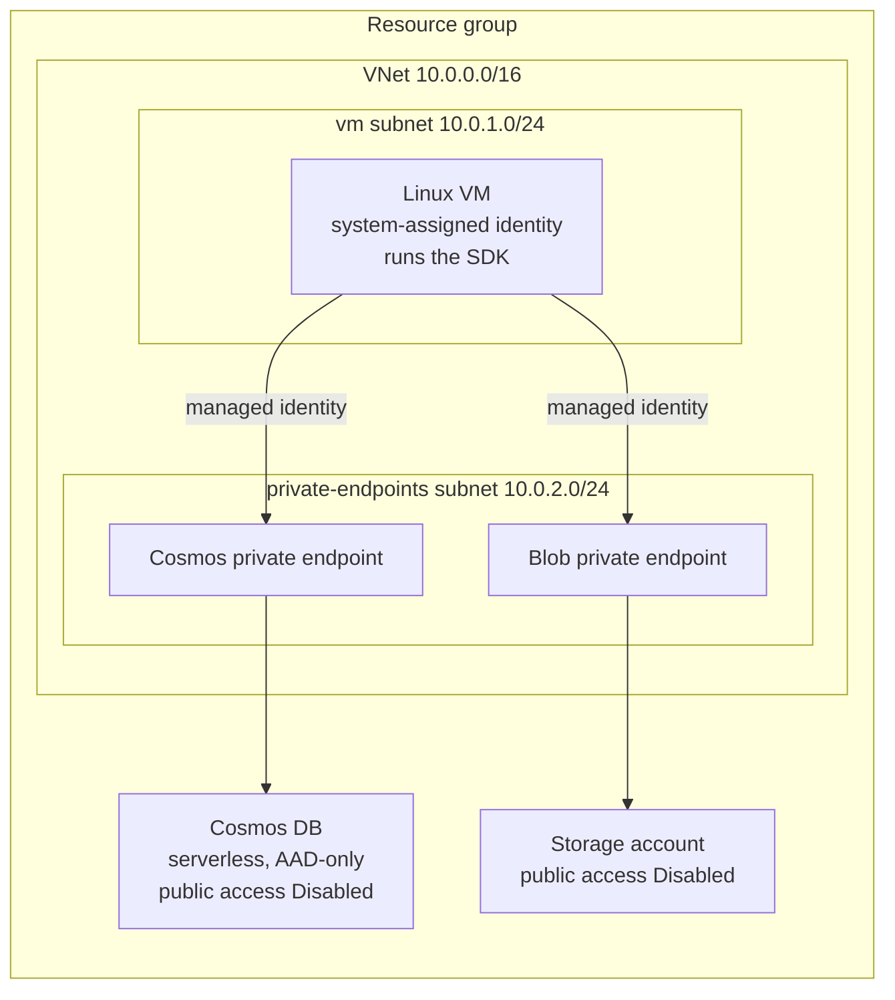

# Infrastructure architecture

Private topology so the Agent Learning SDK runs on a virtual machine inside the
VNet, reaching Cosmos DB and Storage only over private endpoints and
authenticating with the VM's managed identity (no keys or secrets on the box).

The diagram below is embedded from [architecture.mermaid](architecture.mermaid).

