# Agentic decision making

`agent-learning` helps an existing agent make better repeatable choices. It
maintains a small, inspectable TaskPolicy over explicit executable actions and
uses observed outcomes to improve the next choice.

It does not fine-tune the foundation model. It does not require a GPU training
job. The model remains responsible for language and reasoning; the TaskPolicy
is a separate decision layer whose action set, evidence, probabilities, and
history can be inspected.

<p align="center">
  
</p>

## Start with a decision, not a conversation

Create or reuse a TaskPolicy only when all four conditions hold:

1. The agent must choose among at least two explicit executable alternatives.
2. The alternatives are stable enough to reuse on later requests.
3. The choice can affect quality, correctness, latency, cost, safety, or
   completion.
4. An observable outcome can later show whether the choice was useful.

| Good decision policies | Not decision policies |
|---|---|
| Choose a text, semantic, or symbol search strategy. | Answer a factual question. |
| Choose a model or specialized skill for a concrete workload. | Summarize or report information. |
| Choose retrieval depth, a tool workflow, or an escalation path. | Log an ordinary chat turn. |
| Choose an Azure workload against stated criteria. | Run scoring or training automation. |

A question can create the context for a decision, but the question itself is
not the policy. For example, `choose-model-for-code-review` can be a reusable
decision when the workload, alternatives, optimization priority, and success
criterion are known. `answer-which-model-is-best` is not.

Advice is not execution evidence. A recommendation becomes a completed episode
only after the selected action is executed, the user accepts or rejects it, or
another independent outcome can evaluate it. Repeating an unresolved question
five times does not create five useful episodes.

Preserve a recommendation immediately as an incomplete episode so the attempt
and selected policy probability are not lost. Omit outcome fields while
feedback is pending. When acceptance, rejection, or an execution result arrives,
update the same episode ID with the observed result; only then score and train
it. This makes automation able to distinguish pending attempts from trainable
evidence without rewarding the agent for its own recommendation.

## The decision-improvement loop

### 1. Choose

Define a stable `decision_context` and two or more actions that map to real
models, skills, tools, workflows, workloads, or execution strategies. The
active policy turns its logits into probabilities with softmax and samples an
action by default.

`task-policy-decide` returns more than an action. It also returns:

- the current recommended action and the selected action;
- the policy ID, version, probability, and behavior log-probability;
- attempts, correctness rate, and mean reward for each alternative;
- recent result summaries and intent, adherence, and completion scores.

The agent must consume this feedback before execution. Recent failures are
context for what to avoid, and high-quality outcomes are evidence about what to
preserve. Choosing independently after calling the policy breaks the causal
link between the recorded probability and the observed result.

### 2. Execute and capture

Execute `selected_action` and preserve the fields returned by the decision.
The episode joins the choice to what happened:

- user intent and concrete decision context;
- selected action and policy version;
- user-visible output and result summary;
- expected outcome and completion status;
- independently supported correctness evidence.

The durable episode is the unit of learning and audit. It is not merely a tool
invocation log.

### 3. Score the observed outcome

Three core scorers evaluate completed work:

- **Intent resolution:** did the result address what the user needed?
- **Task adherence:** did execution follow the action contract and constraints?
- **Task completion:** did the user-visible task actually finish?

Each normalized score lies in `[0, 1]`. Reward shaping maps the scores into
signed values, weights them, applies configured penalties, and clips the final
reward to `[-1, 1]`.

Scoring uses the local Python standard-library tier by default. NLP, local SLM,
and Azure-hosted LLM tiers are optional when the environment needs different
quality, latency, or dependency tradeoffs.

### 4. Improve the next decision

The learner compares each reward with an exponential moving average baseline.
A better-than-usual outcome increases the selected action's relative logit; a
worse-than-usual outcome decreases it. Entropy regularization keeps some
exploration available.

Training writes a new policy snapshot. It does not alter foundation-model
weights. The next `task-policy-decide` call loads the active snapshot and
returns feedback from the stored executions, closing the loop.

## Evidence-gated autonomy

`task-policy-decide` computes an autonomy assessment for the current
recommended action. Autonomy is granted only when every default gate passes:

| Gate | Default |
|---|---:|
| Scored outcomes for the recommended action | At least 20 |
| Correctness confidence | 95% Wilson lower bound at least 90% |
| Mean aggregate reward | Greater than 0 |
| Recommended-action probability | At least 60% |
| Probability margin over the runner-up | At least 15 percentage points |
| Consecutive trained snapshots with the same winner | At least 3 |

The Wilson bound prevents a small perfect sample from appearing certain. For
example, 20 correct outcomes out of 20 have a lower bound below 90%; roughly 40
perfect independently labeled outcomes pass. Probability is policy preference,
not calibrated correctness confidence, so probability alone never grants
autonomy.

The response's `autonomy.criteria` object reports the actual, required, and
pass/fail value for every gate. Agents consume these authoritative fields:

- `mode: supervised`: execute only within the user's existing authorization and
  request acceptance/rejection when a recommendation has no observable result;
- `mode: autonomous`: use the stable recommended action greedily and do not ask
  for routine confirmation;
- `request_user_feedback: true` with `feedback_reason: drift_audit`: execute or
  present the autonomous action, then request feedback for the sampled audit;
- `outcome_recording: observable_outcome`: register the actual execution result
  instead of asking the user when correctness or completion is observable.

When `observable_outcome_satisfies_feedback` is true, an independently observed
execution result replaces a user prompt even in supervised mode. It is false for
a sampled drift audit because that audit deliberately requests an external user
label.

The default drift-audit rate is 10% of autonomous decisions. A negative audit or
observable execution result changes reward and correctness evidence; subsequent
training can lower probability, break snapshot stability, or fail another gate,
returning the policy to supervised mode.

Configure the thresholds with environment variables:

| Variable | Default |
|---|---:|
| `AGENT_LEARNING_AUTONOMY_MIN_OUTCOMES` | `20` |
| `AGENT_LEARNING_AUTONOMY_MIN_CORRECTNESS_LOWER_BOUND` | `0.90` |
| `AGENT_LEARNING_AUTONOMY_MIN_MEAN_REWARD` | `0.0` |
| `AGENT_LEARNING_AUTONOMY_MIN_ACTION_PROBABILITY` | `0.60` |
| `AGENT_LEARNING_AUTONOMY_MIN_PROBABILITY_MARGIN` | `0.15` |
| `AGENT_LEARNING_AUTONOMY_STABLE_SNAPSHOTS` | `3` |
| `AGENT_LEARNING_AUTONOMY_AUDIT_RATE` | `0.10` |
| `AGENT_LEARNING_AUTONOMY_WILSON_Z` | `1.96` |

Safety, compliance, financial, and destructive-operation approvals remain
outside the learned autonomy gate. A policy preference must never override a
deterministic approval requirement.

## CLI walkthrough

### Establish one durable store

Every CLI command is a separate process, so use the same local store throughout
the workflow:

```powershell
$env:AGENT_LEARNING_STORE_BACKEND = "local"
$env:AGENT_LEARNING_LOCAL_STORE_DIR = Join-Path $env:LOCALAPPDATA "agent-learning\store"
```

The in-memory backend is intended for one-process tests and SDK embedding, not
a multi-command CLI workflow.

### Define and initialize the decision

Create `actions.json`:

```json
[
  {
    "id": "use_text_search",
    "description": "Search exact symbols and terms",
    "parameters": {"strategy": "text"}
  },
  {
    "id": "use_semantic_search",
    "description": "Search the repository by meaning",
    "parameters": {"strategy": "semantic"}
  },
  {
    "id": "use_symbol_search",
    "description": "Find definitions and references through the language server",
    "parameters": {"strategy": "symbol"}
  }
]
```

Discover existing decision policies before creating another one:

```powershell
agent-learn tasks-list code-reviewer --decision-only
```

Initialize only when no existing policy has the same decision context and
action taxonomy:

```powershell
agent-learn task-policy-init `
  --agent-id code-reviewer `
  --task-id choose-repository-search `
  --decision-context "Choose a repository search strategy for a coding task" `
  --actions .\actions.json
```

The CLI marks the policy with `policy_scope: delegated_decision`.

### Choose and execute

```powershell
agent-learn task-policy-decide `
  --agent-id code-reviewer `
  --task-id choose-repository-search
```

Sampling is the default so viable alternatives retain a chance to gather
evidence while a policy is supervised. Add `--greedy` only when deterministic
supervised exploitation is required. Once all autonomy gates pass, the command
selects the stable recommended action greedily regardless of this flag. Execute
the returned `selected_action`, not a separate preference.

### Register independently observed evidence

Build `episode.json` from the returned policy fields and the completed result:

```json
{
  "agent_name": "Code reviewer",
  "task_name": "Choose repository search strategy",
  "user_input": "Find the implementation that controls token refresh.",
  "assistant_output": "Located the refresh path and cited the controlling method.",
  "intent_summary": "Locate the controlling token-refresh implementation",
  "action_type": "search_strategy",
  "action_id": "use_semantic_search",
  "action_name": "Search the repository by meaning",
  "target": "repository",
  "input_summary": "A large Python repository with no known symbol name",
  "expected_outcome": "Locate and cite the controlling implementation",
  "execution_status": "completed",
  "result_summary": "Found the implementation and verified its call site",
  "policy_id": "<policy_id from task-policy-decide>",
  "policy_version": 0,
  "action_logprob": -1.0986122886681098,
  "metadata": {
    "correct_action_id": "use_semantic_search",
    "task_completed": true
  }
}
```

Set `correct_action_id` only when the result supports it independently. It may
differ from `action_id`. Set `task_completed` from the user-visible outcome,
not from whether a tool call returned successfully.

Register against the marked policy:

```powershell
agent-learn task-episode-register `
  --agent-id code-reviewer `
  --task-id choose-repository-search `
  --episode .\episode.json `
  --require-decision-policy
```

### Score, train, and inspect

```powershell
agent-learn score `
  --agent-id code-reviewer `
  --task-id choose-repository-search `
  --limit 100

agent-learn train `
  --agent-id code-reviewer `
  --task-id choose-repository-search `
  --decision-only `
  --min-episodes 5

agent-learn task-policy `
  --agent-id code-reviewer `
  --task-id choose-repository-search
```

Training ignores incomplete work and defaults to at least five completed
episodes. `task-policy` returns the current and previous snapshots so the
probability and logit changes remain inspectable. Call `task-policy-decide`
again before the next execution to consume the new snapshot and historical
feedback. Its `autonomy` object determines whether routine user feedback is
required, sampled for drift, or replaced by an observable execution outcome.

## The math in one minute

For action logits `z`, stable softmax creates positive probabilities that sum
to one:

$$
\pi(a) = \frac{\exp(z_a - \max(z))}{\sum_k \exp(z_k - \max(z))}.
$$

The score layer maps normalized metrics into one clipped reward:

$$
R = \operatorname{clip}\left(\sum_m w_m(2s_m - 1) + \text{penalties}, -1, 1\right).
$$

REINFORCE centers the reward against the baseline, $A = R - b$, and adjusts
each relative logit:

$$
\Delta z_k = \eta A\left(\mathbb{1}[k=a] - \pi(k)\right) + \text{entropy term}.
$$

A logit is not a percentage. Only differences between competing logits matter,
and finite logits never produce an exact probability of one. Conservative batch
updates should move probabilities gradually; fresh evidence and repeated
updates establish a reliable preference.

See [The math, explained simply](math-explained-simply.md) for intuition and
[SDK mathematics](math.md) for the implemented equations.

## Storage and deployment patterns

The decision loop is ordinary Python and does not require a GPU. Match identity
and storage to the host:

| Environment | Scoring and identity | Durable history |
|---|---|---|
| Local development | Default `stdlib` scoring; no endpoint required. | Local JSON store. |
| Azure AI Foundry workload | Optional `[llm]` scoring with an Azure endpoint and managed identity. | Cosmos DB for shared history. |
| AKS | Workload identity for optional Azure scoring; run training in a worker or CronJob. | Cosmos DB across replicas; local files only for single-pod development. |
| Fabric notebook or Spark workflow | Base, `[nlp]`, or compatible local tier when model egress is unwanted. | Cosmos DB for history shared across sessions. |

These are deployment patterns for the SDK's Python, identity, scorer, and store
contracts. They are not dedicated host-specific adapters.

For a multi-process service, install the Cosmos extra and configure one shared
store. For optional Azure scoring, set the `AGENT_LEARNING_SCORE_ENDPOINT`,
`AGENT_LEARNING_SCORE_DEPLOYMENT`, and credential-mode configuration documented
in [Tiered scoring design](design.md).

## Operational rules

- Keep action IDs stable once episodes exist.
- Keep decision context concrete enough that outcomes are comparable.
- Preserve policy ID, version, and behavior log-probability with each choice.
- Never label the selected action correct merely because it was selected.
- Train only completed, scored decision episodes.
- Inspect policy snapshots and recent outcomes rather than treating learning as
  a black box.
- Keep governance, safety constraints, and human approval outside the learned
  preference when they must remain deterministic.

For Scout-specific execution and automation boundaries, see
[Scout decision integration](scout-agent-learn-skill.md) and
[Scout decision training](scout-automation-agent-learning.md).