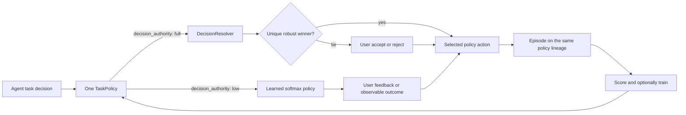

# Agentic decision making

`agent-learning` helps an existing agent make better repeatable choices. It
maintains one small, inspectable TaskPolicy over explicit executable actions.
Depending on its declared decision authority, that policy can resolve current
evidence directly or use observed outcomes to improve the next choice.

It does not fine-tune the foundation model. It does not require a GPU training
job. The model remains responsible for language and reasoning; the TaskPolicy
is a separate decision layer whose action set, evidence, probabilities, and
history can be inspected.

<p align="center">
  
</p>

## Start with a decision, not a conversation

Create or reuse a TaskPolicy only when all four conditions hold:

1. The agent must choose among at least two explicit executable alternatives.
2. The alternatives are stable enough to reuse on later requests.
3. The choice can affect quality, correctness, latency, cost, safety, or
   completion.
4. An observable outcome can later show whether the choice was useful.

| Good decision policies | Not decision policies |
|---|---|
| Choose a text, semantic, or symbol search strategy. | Answer a factual question. |
| Choose a model or specialized skill for a concrete workload. | Summarize or report information. |
| Choose retrieval depth, a tool workflow, or an escalation path. | Log an ordinary chat turn. |
| Choose an Azure workload against stated criteria. | Run scoring or training automation. |

A question can create the context for a decision, but the question itself is
not the policy. For example, `choose-model-for-code-review` can be a reusable
decision when the workload, alternatives, optimization priority, and success
criterion are known. `answer-which-model-is-best` is not.

Advice is not execution evidence. A recommendation becomes a completed episode
only after the selected action is executed, the user accepts or rejects it, or
another independent outcome can evaluate it. Repeating an unresolved question
five times does not create five useful episodes.

Preserve a recommendation immediately as an incomplete episode so the attempt
and selected policy probability are not lost. Omit outcome fields while
feedback is pending. When acceptance, rejection, or an execution result arrives,
update the same episode ID with the observed result; only then score and train
it. This makes automation able to distinguish pending attempts from trainable
evidence without rewarding the agent for its own recommendation.

## One TaskPolicy, two selection routes

An `(agent_id, task_id)` delegated decision owns one active TaskPolicy and one
stable action taxonomy. Reasoned resolution and reinforcement learning are two
routes into that policy, not separate policy types:



  ### Entity relationship model

  The following model combines logical SDK identities, durable records, runtime
  strategy objects, and request-scoped Bayesian objects. `Agent` and `Decision
  Task` are logical identities projected as `AgentSummary` and `AgentTaskSummary`;
  their durable keys are the `agent_id` and `task_id` carried by snapshots,
  episodes, rewards, and runs.

  The standalone source for Draw.io import is
  [agent-learning-erd.mermaid](agent-learning-erd.mermaid). The imported,
  editable rendering is [erd.drawio](erd.drawio).

  ```mermaid
  erDiagram
    AGENT ||--o{ DECISION_TASK : owns
    DECISION_TASK ||--|| TASK_POLICY : has_one
    TASK_POLICY ||--|{ POLICY_SNAPSHOT : versions
    POLICY_SNAPSHOT ||--|{ ACTION : declares
    DECISION_AUTHORITY ||--o{ POLICY_SNAPSHOT : configures
    POLICY_SNAPSHOT ||--|| COMPLEXITY_PROFILE : constrains
    COMPLEXITY_PROFILE ||--o{ COMPLEXITY_ASSESSMENT : derives
    POLICY_SNAPSHOT ||--o{ AUTONOMY_ASSESSMENT : evaluates
    COMPLEXITY_ASSESSMENT ||--o{ AUTONOMY_ASSESSMENT : scales

    TASK_POLICY ||--o| SOFTMAX_POLICY : delegates_low
    POLICY_SNAPSHOT ||--o| SOFTMAX_POLICY : hydrates
    SOFTMAX_POLICY ||--o{ POLICY_DECISION : samples
    POLICY_DECISION }o--|| ACTION : chooses
    POLICY_DECISION o|--|| DECISION_RESULT : normalizes_to
    EPISODE ||--o{ METRIC_RESULT : evaluates_as
    EPISODE ||--o{ REWARD : receives
    REWARD_SHAPER ||--o{ METRIC_RESULT : combines
    REWARD_SHAPER ||--o{ REWARD : produces
    REINFORCE_LEARNER ||--o{ EPISODE : consumes_low_only
    REINFORCE_LEARNER ||--o{ REWARD : optimizes_from
    REINFORCE_LEARNER ||--o{ TRAINING_RUN : records
    REINFORCE_LEARNER ||--o{ POLICY_SNAPSHOT : advances

    TASK_POLICY ||--o| DECISION_RESOLVER : delegates_full
    DECISION_TASK ||--o{ DECISION_FRAME : contextualizes
    DECISION_RESOLVER ||--o{ DECISION_FRAME : evaluates
    DECISION_FRAME ||--|{ DECISION_CRITERION : defines
    DECISION_FRAME ||--|{ DECISION_OPTION : compares
    DECISION_OPTION }o--|| ACTION : references
    DECISION_OPTION ||--o{ EVIDENCE_POINT : contains
    DECISION_CRITERION ||--o{ EVIDENCE_POINT : measures
    DECISION_RESOLVER o|--o{ DECISION_RESULT : emits
    DECISION_RESULT ||--o{ OPTION_ASSESSMENT : contains
    OPTION_ASSESSMENT }o--|| ACTION : assesses
    OPTION_ASSESSMENT ||--o{ CRITERION_ASSESSMENT : decomposes_into
    DECISION_CRITERION ||--o{ CRITERION_ASSESSMENT : summarizes
    DECISION_RESULT ||--o{ INFORMATION_NEED : requests
    DECISION_STATUS ||--o{ DECISION_RESULT : classifies
    TIE_BREAK_DISPOSITION o|--o{ DECISION_RESULT : adjudicates

    AUTONOMY_ASSESSMENT o|--o{ DECISION_RESULT : gates_low_execution
    DECISION_RESULT }o--o| ACTION : selects_or_proposes
    DECISION_RESULT o|--o| EPISODE : becomes_after_execution
    POLICY_SNAPSHOT ||--o{ EPISODE : attributes
    ACTION ||--o{ EPISODE : executes_in

    AGENT {
      string agent_id PK
      string name
    }
    DECISION_TASK {
      string agent_id PK, FK
      string task_id PK
      string decision_context
    }
    TASK_POLICY {
      string agent_id FK
      string task_id FK
      enum authority
    }
    POLICY_SNAPSHOT {
      string policy_id PK
      string agent_id FK
      string task_id FK
      int version
      json logits
      float baseline
      json metadata
    }
    DECISION_AUTHORITY {
      enum value PK
    }
    COMPLEXITY_PROFILE {
      string policy_id PK, FK
      string intent_ambiguity
      string context_variability
      string outcome_observability
      string decision_impact
      string reversibility
      bool requires_human_approval
    }
    COMPLEXITY_ASSESSMENT {
      int score
      string tier
      json risk_floors
    }
    AUTONOMY_ASSESSMENT {
      bool eligible
      string authorization_basis
      string recommended_action_id FK
      json criteria
    }
    ACTION {
      string policy_id PK, FK
      string action_id PK
      string description
      json parameters
    }
    SOFTMAX_POLICY {
      string policy_id FK
      float max_logit_abs
    }
    POLICY_DECISION {
      string action_id FK
      float logprob
      json probabilities
    }
    DECISION_RESOLVER {
      string algorithm
    }
    DECISION_FRAME {
      string task
      float minimum_margin
      float uncertainty_penalty
      float max_uncertainty
    }
    DECISION_CRITERION {
      string criterion_id
      float weight
      int minimum_sources
    }
    DECISION_OPTION {
      string action_id FK
      json constraint_results
    }
    EVIDENCE_POINT {
      string criterion_id FK
      string source
      float support
      float confidence
    }
    CRITERION_ASSESSMENT {
      string criterion_id FK
      float posterior_support
      float entropy_bits
      float disagreement_bits
      int source_count
    }
    OPTION_ASSESSMENT {
      string action_id FK
      bool feasible
      float expected_utility
      float uncertainty
      float robust_utility
    }
    INFORMATION_NEED {
      string kind
      string option_id FK
      string field_id
      float information_gain_bits
    }
    TIE_BREAK_DISPOSITION {
      enum value PK
    }
    DECISION_STATUS {
      enum value PK
    }
    DECISION_RESULT {
      string policy_id FK
      int policy_version
      string status
      string selection_basis
      string selected_action_id FK
      string proposed_action_id FK
      string authorization_basis
      float action_logprob
    }
    EPISODE {
      string episode_id PK
      string agent_id FK
      string task_id FK
      string policy_id FK
      int policy_version
      string action_id FK
      float action_logprob
      string execution_status
      json metadata
    }
    METRIC_RESULT {
      string episode_id FK
      enum metric
      float normalized
      string status
    }
    REWARD {
      string reward_id PK
      string episode_id FK
      enum source
      float value
    }
    REWARD_SHAPER {
      float intent_weight
      float adherence_weight
      float completion_weight
    }
    REINFORCE_LEARNER {
      float learning_rate
      float baseline_decay
      float entropy_bonus
    }
    TRAINING_RUN {
      string run_id PK
      string policy_id FK
      string task_id FK
      string algorithm
      string status
    }
  ```

  The branch relationship is exclusive at decision time: `decision_authority:
  low` uses `SoftmaxPolicy`, while `decision_authority: full` uses
  `DecisionResolver`. Information theory is used in both places but is not a
  synonym for RL: the learned route uses policy probabilities and entropy
  regularization, while the Bayesian route uses posterior entropy and information
  gain to identify the next useful observation.

  Both routes normalize to the same public result and observable outcome:

  ```python
  learned_result: DecisionResult = task_policy.decide()
  reasoned_result: DecisionResult = task_policy.decide(decision_frame)
  ```

  Each `DecisionResult` references only an `Action` owned by the same
  `PolicySnapshot`. Once resolved or accepted, execution is captured as the same
  `Episode` type and evaluated through the same `MetricResult` and `Reward`
  types. Only low-authority episodes enter `ReinforceLearner`; full-authority
  episodes remain scored audit evidence because their action was not sampled from
  the softmax behavior policy.

  The Python-to-entity mapping is:

  | Model area | Concrete classes or durable shapes |
  |---|---|
  | Logical identity | `AgentSummary` / `agent_id`; `AgentTaskSummary` / `task_id` |
  | Unified policy | `TaskPolicy`, `PolicySnapshot`, `Action`, `DecisionAuthority` |
  | Governance | `ComplexityProfile`, `ComplexityAssessment`, `AutonomyAssessment` |
  | Learned route | `SoftmaxPolicy`, `policy.base.Decision`, `Episode`, `MetricResult`, `RewardShaper`, `Reward`, `ReinforceLearner`, `TrainingRun` |
  | Bayesian route | `DecisionResolver`, `DecisionFrame`, `DecisionCriterion`, `DecisionOption`, `EvidencePoint`, `CriterionAssessment`, `OptionAssessment`, `InformationNeed` |
  | Shared convergence | `DecisionResult`, `DecisionStatus`, `TieBreakDisposition`, selected `Action`, then `Episode` |

  `TaskPolicy`, `SoftmaxPolicy`, `DecisionResolver`, `RewardShaper`, and
  `ReinforceLearner` are runtime objects. `DecisionFrame` and its evidence are request-scoped.
  `DecisionResult` is a serializable certificate that the host preserves while a
  tie-break is pending. `PolicySnapshot`, `Episode`, `MetricResult`, `Reward`, and
  `TrainingRun` are durable store records. The relationship from `DecisionResult`
  to `Episode` is execution lineage rather than a stored result foreign key.

The persisted `decision_authority` field controls action selection:

| Authority | Selection route | When user input is required |
|---|---|---|
| `low` | Select from the TaskPolicy's learned softmax probabilities. Outcomes, accept/reject feedback, scoring, and REINFORCE improve later choices. | While supervised and no independently observable outcome is available. |
| `full` | Apply hard constraints, Bayesian evidence aggregation, Pareto elimination, robust utility, and information-needs analysis to a supplied `DecisionFrame`. | When leading options remain within the configured margin or deterministic human approval is required. |

Existing snapshots without this field behave as `low`. Both routes return the
same agent ID, task ID, policy ID, policy version, and policy-owned actions.
`DecisionResolver` rejects a frame that adds, removes, or redefines an action.
A reasoned choice records `action_logprob: null` because it was not sampled
from the softmax behavior policy. Its observed outcome can still be attached to
the same TaskPolicy, scored, and audited, but it does not enter REINFORCE while
the policy uses full decision authority.

### Keep the three autonomy axes separate

Decision authority is not the existing complexity tier or the current
execution authorization:

| Axis | Values | Question answered |
|---|---|---|
| Decision authority | `low`, `full` | May this policy resolve the current frame, or must it rely on learned preference? |
| Complexity tier | `low`, `standard`, `high`, `critical` | How much evidence and auditing does this decision require? |
| Execution authorization | `supervised`, `autonomous` | May the selected action execute without routine confirmation now? |

Full authority does not override hard constraints,
`requires_human_approval`, safety controls, or operating-system and service
permissions. Low authority can eventually earn statistical execution autonomy,
but it continues selecting from learned policy evidence. These distinctions
prevent a strong reasoning result from becoming an implicit permission grant.

## Reasoned resolution

The resolver evaluates a decision frame

$$
\mathcal F=(\mathcal X,\mathcal A,\mathcal Y,U,\mathcal C,\mathcal H),
$$

where $\mathcal X$ is current information, $\mathcal A$ is the TaskPolicy's
fixed action set, $\mathcal Y$ is the outcome space, $U$ is stakeholder utility,
$\mathcal C$ is the set of hard constraints, and $\mathcal H$ is the human
authority boundary.

Resolution proceeds in this order:

1. Eliminate actions that fail a hard constraint. Missing constraint results
  become information needs; they are not treated as passes.
2. Require the declared number of independent sources for every weighted
  criterion.
3. Combine source support with confidence-weighted log odds. For source support
  $p_{a,c,s}$ and confidence $\gamma_{a,c,s}$:

  $$
  L_{a,c}=\sum_s \gamma_{a,c,s}
  \log\frac{p_{a,c,s}}{1-p_{a,c,s}},
  \qquad
  P_{a,c}=\sigma(L_{a,c}).
  $$

4. Measure remaining binary uncertainty in bits:

  $$
  H(P)=-P\log_2P-(1-P)\log_2(1-P).
  $$

5. Eliminate Pareto-dominated actions, then compute expected and robust utility:

  $$
  EU(a)=\frac{\sum_c w_cP_{a,c}}{\sum_c w_c},
  \qquad
  RU(a)=EU(a)-\lambda
  \frac{\sum_c w_cH(P_{a,c})}{\sum_c w_c}.
  $$

6. Select the highest robust utility only when it exceeds the runner-up by the
  configured `minimum_margin`. Otherwise request an explicit tie-break.

The conceptual next-question objective is expected information gain per unit
cost,

$$
q^*=\arg\max_q\frac{I(A^*;q\mid E)}{\operatorname{cost}(q)}.
$$

The current resolver reports a deterministic entropy-reduction upper bound for
missing constraints and criterion evidence. A host with query costs and an
observation model can refine that ordering into full expected value of
information without changing the TaskPolicy contract.

### Accept and reject are not symmetric shortcuts

When reasoned options tie, the resolver proposes them in deterministic robust
utility and action-ID order. `accept` selects the proposed policy action.
`reject` rules out only that proposal and advances to the next tied action; the
last remaining action still requires explicit acceptance. Rejecting every tied
action returns `no_viable_option` so the frame must be revised.

For a low-authority learned recommendation, `reject` is a negative outcome, not
proof that the next action is correct. It returns `rejected`; the host records
that feedback against the same episode and lets scoring and learning update the
TaskPolicy before deciding again. An independently observable result can replace
an accept/reject prompt when the policy's autonomy response permits it.

## The decision-improvement loop

### 1. Choose

Define a stable `decision_context` and two or more actions that map to real
models, skills, tools, workflows, workloads, or execution strategies. A
low-authority policy turns its logits into probabilities with softmax and
samples an action by default. A full-authority policy resolves a supplied frame
against the same action set.

`task-policy-decide` returns more than an action. It also returns:

- the current recommended action and the selected action;
- the policy ID, version, probability, and behavior log-probability;
- attempts, correctness rate, and mean reward for each alternative;
- recent result summaries and intent, adherence, and completion scores.

The agent must consume this feedback before execution. Recent failures are
context for what to avoid, and high-quality outcomes are evidence about what to
preserve. Choosing independently after calling the policy breaks the causal
link between the recorded probability and the observed result.

### 2. Execute and capture

Execute `selected_action` and preserve the fields returned by the decision.
The episode joins the choice to what happened:

- user intent and concrete decision context;
- selected action and policy version;
- user-visible output and result summary;
- expected outcome and completion status;
- independently supported correctness evidence.

The durable episode is the unit of learning and audit. It is not merely a tool
invocation log.

### 3. Score the observed outcome

Three core scorers evaluate completed work:

- **Intent resolution:** did the result address what the user needed?
- **Task adherence:** did execution follow the action contract and constraints?
- **Task completion:** did the user-visible task actually finish?

Each normalized score lies in `[0, 1]`. Reward shaping maps the scores into
signed values, weights them, applies configured penalties, and clips the final
reward to `[-1, 1]`.

Scoring uses the local Python standard-library tier by default. NLP, local SLM,
and Azure-hosted LLM tiers are optional when the environment needs different
quality, latency, or dependency tradeoffs.

### 4. Improve the next decision

The learner compares each reward with an exponential moving average baseline.
A better-than-usual outcome increases the selected action's relative logit; a
worse-than-usual outcome decreases it. Entropy regularization keeps some
exploration available.

Training writes a new policy snapshot. It does not alter foundation-model
weights. The next `task-policy-decide` call loads the active snapshot and
returns feedback from the stored executions, closing the loop.

## Evidence-gated autonomy

`task-policy-decide` computes an autonomy assessment for the current
recommended action. The table below is the backward-compatible `standard` tier;
low, high, and critical policies use proportionally different requirements:

| Gate | Default |
|---|---:|
| Scored outcomes for the recommended action | At least 20 |
| Correctness confidence | 95% Wilson lower bound at least 90% |
| Mean aggregate reward | Greater than 0 |
| Recommended-action probability | At least 60% |
| Probability margin over the runner-up | At least 15 percentage points |
| Consecutive trained snapshots with the same winner | At least 3 |

The Wilson bound prevents a small perfect sample from appearing certain. For
example, 20 correct outcomes out of 20 have a lower bound below 90%; roughly 40
perfect independently labeled outcomes pass. Probability is policy preference,
not calibrated correctness confidence, so probability alone never grants
autonomy.

Explicit user acceptance is a separate authorization path. When a completed
episode records `metadata.feedback_status: accepted`, the accepted action is
used for that agent and task without waiting for statistical thresholds. The
response reports `authorization_basis: user_acceptance`, uses an audit rate of
zero, and does not ask again. A later explicit `rejected` episode revokes that
approval. Deterministic `requires_human_approval` policies remain supervised.

The response's `autonomy.criteria` object reports the actual, required, and
pass/fail value for every gate. Agents consume these authoritative fields:

- `mode: supervised`: execute only within the user's existing authorization and
  request acceptance/rejection when a recommendation has no observable result;
- `mode: autonomous`: use the stable recommended action greedily and do not ask
  for routine confirmation;
- `request_user_feedback: true` with `feedback_reason: drift_audit`: execute or
  present the autonomous action, then request feedback for the sampled audit;
- `outcome_recording: observable_outcome`: register the actual execution result
  instead of asking the user when correctness or completion is observable.

When `observable_outcome_satisfies_feedback` is true, an independently observed
execution result replaces a user prompt even in supervised mode. It is false for
a sampled drift audit because that audit deliberately requests an external user
label.

The standard drift-audit rate is 10% of statistically autonomous decisions.
Low, high, and critical tiers use 5%, 25%, and 50%. Explicitly accepted policies
use 0%. A negative audit or observable execution result changes reward and
correctness evidence; subsequent training can lower probability, break snapshot
stability, or fail another gate, returning the policy to supervised mode.

The tier comes from a persisted profile of intent ambiguity, context
variability, outcome observability, decision impact, reversibility, and derived
action-space size. Critical impact, high-impact irreversible actions, and
ambiguous subjective outcomes apply risk floors. `requires_human_approval`
blocks learned autonomy regardless of evidence. See
[Complexity-proportional autonomy](autonomy-complexity.md) for the complete
scoring and threshold tables.

Environment variables override the resolved tier thresholds globally:

| Variable | Default |
|---|---:|
| `AGENT_LEARNING_AUTONOMY_MIN_OUTCOMES` | `20` |
| `AGENT_LEARNING_AUTONOMY_MIN_CORRECTNESS_LOWER_BOUND` | `0.90` |
| `AGENT_LEARNING_AUTONOMY_MIN_MEAN_REWARD` | `0.0` |
| `AGENT_LEARNING_AUTONOMY_MIN_ACTION_PROBABILITY` | `0.60` |
| `AGENT_LEARNING_AUTONOMY_MIN_PROBABILITY_MARGIN` | `0.15` |
| `AGENT_LEARNING_AUTONOMY_STABLE_SNAPSHOTS` | `3` |
| `AGENT_LEARNING_AUTONOMY_AUDIT_RATE` | `0.10` |
| `AGENT_LEARNING_AUTONOMY_WILSON_Z` | `1.96` |

Safety, compliance, financial, and destructive-operation approvals remain
outside the learned autonomy gate. A policy preference must never override a
deterministic approval requirement.

The visual represents statistical autonomy as a fifth stage after policy
improvement. Its return path remains active: every observable outcome is scored,
10% of standard-tier statistical decisions request a user drift audit by
default, and failing evidence can return the next decision to supervised mode.

## CLI walkthrough

### Establish one durable store

Every CLI command is a separate process, so use the same local store throughout
the workflow:

```powershell
$env:AGENT_LEARNING_STORE_BACKEND = "local"
$env:AGENT_LEARNING_LOCAL_STORE_DIR = Join-Path $env:LOCALAPPDATA "agent-learning\store"
```

The in-memory backend is intended for one-process tests and SDK embedding, not
a multi-command CLI workflow.

### Define and initialize the decision

Create `actions.json`:

```json
[
  {
    "id": "use_text_search",
    "description": "Search exact symbols and terms",
    "parameters": {"strategy": "text"}
  },
  {
    "id": "use_semantic_search",
    "description": "Search the repository by meaning",
    "parameters": {"strategy": "semantic"}
  },
  {
    "id": "use_symbol_search",
    "description": "Find definitions and references through the language server",
    "parameters": {"strategy": "symbol"}
  }
]
```

Create `complexity.json` using the fields in
[Complexity-proportional autonomy](autonomy-complexity.md). Do not derive a
lower tier from persuasive wording. When no profile is supplied, the SDK uses a
conservative standard profile.

Declare decision authority separately. `low` is the backward-compatible
default and uses learned softmax evidence. `full` requires an explicit owner
grant and resolves a request-specific DecisionFrame. Neither value changes the
complexity profile or bypasses `requires_human_approval`.

Discover existing decision policies before creating another one:

```powershell
agent-learn tasks-list code-reviewer --decision-only
```

Initialize only when no existing policy has the same decision context and
action taxonomy:

```powershell
agent-learn task-policy-init `
  --agent-id code-reviewer `
  --task-id choose-repository-search `
  --decision-context "Choose a repository search strategy for a coding task" `
  --actions .\actions.json `
  --complexity-profile .\complexity.json `
  --decision-authority low
```

The CLI marks the policy with `policy_scope: delegated_decision` and persists
the validated profile. Configure an existing policy without creating a learned
snapshot:

```powershell
agent-learn task-policy-complexity-set `
  --agent-id code-reviewer `
  --task-id choose-repository-search `
  --profile .\complexity.json
```

Migrate an existing policy in place only after its owner grants the authority:

```powershell
agent-learn task-policy-authority-set `
  --agent-id code-reviewer `
  --task-id choose-repository-search `
  --authority full
```

This changes policy configuration, not its ID, version, action set, or learned
snapshot history. Never create parallel low and full policies for one decision.

### Low authority: choose and execute

```powershell
agent-learn task-policy-decide `
  --agent-id code-reviewer `
  --task-id choose-repository-search
```

Sampling is the default so viable alternatives retain a chance to gather
evidence while a policy is supervised. Add `--greedy` only when deterministic
supervised exploitation is required. Once all autonomy gates pass, the command
selects the stable recommended action greedily regardless of this flag. Execute
the returned `selected_action`, not a separate preference.

### Full authority: resolve and adjudicate

Build `decision-frame.json` with every policy action exactly once. Evidence
support is in `[0,1]`, confidence is in `(0,1]`, and source names must represent
independent observations:

```json
{
  "task": "Choose a repository search strategy for this request",
  "criteria": [
    {"id": "expected_success", "weight": 0.8, "minimum_sources": 2},
    {"id": "latency_fit", "weight": 0.2, "minimum_sources": 1}
  ],
  "constraints": ["tool_available"],
  "options": [
    {
      "action_id": "use_text_search",
      "constraint_results": {"tool_available": true},
      "evidence": [
        {"criterion_id": "expected_success", "source": "query_shape", "support": 0.6},
        {"criterion_id": "expected_success", "source": "repository_index", "support": 0.7},
        {"criterion_id": "latency_fit", "source": "latency_budget", "support": 0.9}
      ]
    },
    {
      "action_id": "use_semantic_search",
      "constraint_results": {"tool_available": true},
      "evidence": [
        {"criterion_id": "expected_success", "source": "query_shape", "support": 0.9},
        {"criterion_id": "expected_success", "source": "repository_index", "support": 0.8},
        {"criterion_id": "latency_fit", "source": "latency_budget", "support": 0.7}
      ]
    },
    {
      "action_id": "use_symbol_search",
      "constraint_results": {"tool_available": true},
      "evidence": [
        {"criterion_id": "expected_success", "source": "query_shape", "support": 0.5},
        {"criterion_id": "expected_success", "source": "repository_index", "support": 0.6},
        {"criterion_id": "latency_fit", "source": "latency_budget", "support": 0.8}
      ]
    }
  ]
}
```

Resolve against the same active TaskPolicy:

```powershell
agent-learn task-policy-decide `
  --agent-id code-reviewer `
  --task-id choose-repository-search `
  --decision-frame .\decision-frame.json
```

Execute a `resolved` result only when its `autonomy` block permits execution.
For `needs_evidence`, collect the highest-ranked `information_needs` item and
resolve the updated frame. For `needs_user_tie_break` or
`needs_user_feedback`, persist the complete command output and apply exactly one
binary response:

```powershell
agent-learn task-policy-adjudicate `
  --agent-id code-reviewer `
  --task-id choose-repository-search `
  --decision-result .\decision-result.json `
  --disposition accept
```

Rejecting one tied proposal advances to another tied proposal; it does not
select that alternative. The next proposal still requires acceptance. A
reasoned result carries `selection_basis: bayesian_decision` and
`action_logprob: null` because it was not sampled from the softmax policy.
The result is bound to its exact policy ID and version. If the active snapshot
changes before adjudication, discard the stale certificate and resolve the
DecisionFrame again against the current TaskPolicy; never transfer a tie-break
to a different policy snapshot.

### Register independently observed evidence

Build `episode.json` from the returned policy fields and the completed result:

```json
{
  "agent_name": "Code reviewer",
  "task_name": "Choose repository search strategy",
  "user_input": "Find the implementation that controls token refresh.",
  "assistant_output": "Located the refresh path and cited the controlling method.",
  "intent_summary": "Locate the controlling token-refresh implementation",
  "action_type": "search_strategy",
  "action_id": "use_semantic_search",
  "action_name": "Search the repository by meaning",
  "target": "repository",
  "input_summary": "A large Python repository with no known symbol name",
  "expected_outcome": "Locate and cite the controlling implementation",
  "execution_status": "completed",
  "result_summary": "Found the implementation and verified its call site",
  "policy_id": "<policy_id from task-policy-decide>",
  "policy_version": 0,
  "action_logprob": -1.0986122886681098,
  "metadata": {
    "selection_basis": "learned_policy",
    "correct_action_id": "use_semantic_search",
    "task_completed": true
  }
}
```

Set `correct_action_id` only when the result supports it independently. It may
differ from `action_id`. Set `task_completed` from the user-visible outcome,
not from whether a tool call returned successfully.

Register against the marked policy:

```powershell
agent-learn task-episode-register `
  --agent-id code-reviewer `
  --task-id choose-repository-search `
  --episode .\episode.json `
  --require-decision-policy
```

### Score, train, and inspect

For low authority, score and train completed episodes:

```powershell
agent-learn score `
  --agent-id code-reviewer `
  --task-id choose-repository-search `
  --limit 100

agent-learn train `
  --agent-id code-reviewer `
  --task-id choose-repository-search `
  --decision-only `
  --min-episodes 5

agent-learn task-policy `
  --agent-id code-reviewer `
  --task-id choose-repository-search
```

Training ignores incomplete work and defaults to at least five completed
episodes. `task-policy` returns the current and previous snapshots so the
probability and logit changes remain inspectable. Call `task-policy-decide`
again before the next execution to consume the new snapshot and historical
feedback. Its `autonomy` object determines whether routine user feedback is
required, sampled for drift, or replaced by an observable execution outcome.

For full authority, score completed episodes for quality and audit, but do not
run REINFORCE. `agent-learn train --decision-only` rejects the policy because a
Bayesian argmax has no softmax behavior propensity and the policy logits do not
control full-authority selection.

## The math in one minute

For action logits `z`, stable softmax creates positive probabilities that sum
to one:

$$
\pi(a) = \frac{\exp(z_a - \max(z))}{\sum_k \exp(z_k - \max(z))}.
$$

The score layer maps normalized metrics into one clipped reward:

$$
R = \operatorname{clip}\left(\sum_m w_m(2s_m - 1) + \text{penalties}, -1, 1\right).
$$

REINFORCE centers the reward against the baseline, $A = R - b$, and adjusts
each relative logit:

$$
\Delta z_k = \eta A\left(\mathbb{1}[k=a] - \pi(k)\right) + \text{entropy term}.
$$

A logit is not a percentage. Only differences between competing logits matter,
and finite logits never produce an exact probability of one. Conservative batch
updates should move probabilities gradually; fresh evidence and repeated
updates establish a reliable preference.

See [The math, explained simply](math-explained-simply.md) for intuition and
[SDK mathematics](math.md) for the implemented equations.

## Storage and deployment patterns

The decision loop is ordinary Python and does not require a GPU. Match identity
and storage to the host:

| Environment | Scoring and identity | Durable history |
|---|---|---|
| Local development | Default `stdlib` scoring; no endpoint required. | Local JSON store. |
| Azure AI Foundry workload | Optional `[llm]` scoring with an Azure endpoint and managed identity. | Cosmos DB for shared history. |
| AKS | Workload identity for optional Azure scoring; run training in a worker or CronJob. | Cosmos DB across replicas; local files only for single-pod development. |
| Fabric notebook or Spark workflow | Base, `[nlp]`, or compatible local tier when model egress is unwanted. | Cosmos DB for history shared across sessions. |

These are deployment patterns for the SDK's Python, identity, scorer, and store
contracts. They are not dedicated host-specific adapters.

For a multi-process service, install the Cosmos extra and configure one shared
store. For optional Azure scoring, set the `AGENT_LEARNING_SCORE_ENDPOINT`,
`AGENT_LEARNING_SCORE_DEPLOYMENT`, and credential-mode configuration documented
in [Tiered scoring design](design.md).

## Operational rules

- Keep action IDs stable once episodes exist.
- Keep decision context concrete enough that outcomes are comparable.
- Preserve policy ID, version, and behavior log-probability with each choice.
- Never label the selected action correct merely because it was selected.
- Train only completed, scored decision episodes.
- Inspect policy snapshots and recent outcomes rather than treating learning as
  a black box.
- Keep governance, safety constraints, and human approval outside the learned
  preference when they must remain deterministic.

For Scout-specific execution and automation boundaries, see
[Scout decision integration](scout-agent-learn-skill.md) and
[Scout decision training](scout-automation-agent-learning.md).